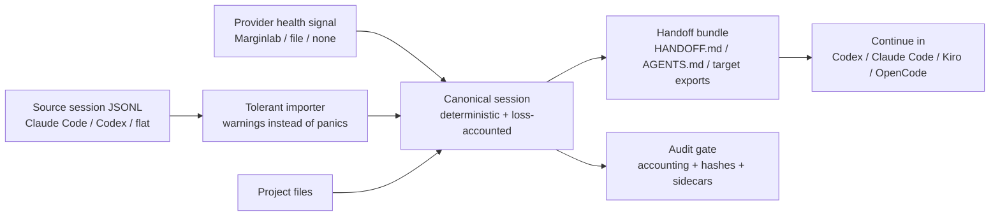

# Agent Airlift

[](https://github.com/AgentAirlift/AgentAirlift/actions/workflows/rust.yml)
[](LICENSE-MIT)
[](https://github.com/AgentAirlift/AgentAirlift/stargazers)

Provider degraded? Airlift your AI coding session to another agent without
losing the working context.

Agent Airlift is a local, deterministic CLI for moving an AI coding session from
one harness to another, for example Claude Code to Codex, Kiro, or OpenCode. It
imports the source JSONL, normalizes it into a canonical loss-accounted schema,
and emits handoff docs plus target-shaped exports.

No AI APIs are called during conversion. Nothing is uploaded. Transfers are
explicit.



## Install

From a checkout:

```bash
cargo install --path .
agent-airlift --help
```

For local Codex and Claude Code slash-command integration:

```bash
./scripts/agent-airlift install-all
```

Codex-only and Claude-only installers are also available:

```bash
./scripts/agent-airlift install-codex
./scripts/agent-airlift install-claude
```

The installers build the release binary, replace older local plugin files, and
back up overwritten Codex prompts/skills as `.bak`, `.bak.1`, and so on.

## Quick Start

Run a full migration using checked-in fixtures:

```bash
agent-airlift demo \
  --session examples/sessions/claude-code-realistic.jsonl \
  --project examples/projects/tiny-rust-cli \
  --out ./airlift-out \
  --source claude-code \
  --targets codex,kiro,opencode \
  --provider-health file \
  --provider-health-file examples/provider-health/degraded.marginlab.cached.json
```

Or, without installing first:

```bash
cargo run -- demo \
  --session examples/sessions/claude-code-realistic.jsonl \
  --project examples/projects/tiny-rust-cli \
  --out ./airlift-out \
  --source claude-code \
  --targets codex,kiro,opencode \
  --provider-health file \
  --provider-health-file examples/provider-health/degraded.marginlab.cached.json
```

Output is written under `airlift-out/`:

```text
raw/          source session copy, repo snapshot, provider health
normalized/   canonical-session.json
replay/       agent-airlift.session.jsonl
exports/      HANDOFF.md, AGENTS.md, target-shaped exports
audit/        conversion-report.md, warnings.json, dropped-fields.json,
              import-diagnostics.json, ci-gate.json
```

The generated `HANDOFF.md` starts with the reason for transfer, current
objective, current state, important files, decisions, risks, and a resume prompt.
The generated `audit/ci-gate.json` must pass before the migration is considered
safe to hand off.

## Money-Shot Demo

Use the demo script when recording a terminal GIF or proving the workflow to a
new user:

```bash
bash demos/money-shot.sh ./airlift-demo-out
```

It shows the core launch story in one flow:

1. Read a degraded Claude Code provider-health signal.
2. Airlift a realistic Claude Code session into Codex, Kiro, and OpenCode.
3. Print the generated `HANDOFF.md` proof that context survived.
4. Print the CI gate proving accounting, hashes, and exports passed.

If you use [VHS](https://github.com/charmbracelet/vhs), the starter tape is:

```bash
vhs demos/money-shot.tape
```

## Plugin Commands

The optional plugins add two commands to Codex and Claude Code:

- `/airlift-check` refreshes provider health and recommends an airlift only when
  the active provider looks degraded.
- `/airlift-migrate` runs the same deterministic migration pipeline and prints
  the handoff bundle path plus a resume prompt.

Pairing is cross-tool: the Claude plugin checks `claude-code` and airlifts to
`codex`; the Codex plugin checks `codex` and airlifts to `claude-code`.

## What Gets Preserved

| Data | Behavior |
|------|----------|
| User and assistant turns | Converted into canonical turns with stable hashes |
| Tool calls and tool results | Captured as structured blocks where present |
| Unknown source fields | Preserved in metadata instead of silently dropped |
| Malformed JSONL rows | Recorded as structured warnings; importer does not panic |
| Claude compact summaries | Provenance-marked as summaries instead of lost |
| Decision records | `DECISION`, `RATIONALE`, and `STATUS` records are lifted into handoff docs |
| Provider health | Stored with source, status, confidence, and reason |
| Repo context | Snapshot of relevant project files, excluding sensitive/heavy paths |

For higher-fidelity handoffs, add the paste-ready snippet in
[`examples/decision-records.md`](examples/decision-records.md) to a project's
`CLAUDE.md` or `AGENTS.md`.

## Supported Import Formats

The importer tolerates JSONL variations and never panics on malformed lines.
Detected format and confidence are recorded in `audit/import-diagnostics.json`.

| Format | Shape |
|--------|-------|
| `claude-code` | `{type, message:{role, content: string | blocks}}`; tool_use / tool_result blocks captured; compact continuation summaries are provenance-marked as `summary`; meta and unknown records are preserved instead of dropped |
| `codex` | `session_meta` + `event_msg` user/agent rows + deduped `response_item` rows |
| `flat` | `{id, role, content, timestamp, ...}` with unknown fields preserved |

Realistic fixtures live in `examples/sessions/`.

## Provider Health

Provider health is optional. It can come from a local file, live Marginlab fetch,
or be disabled:

```bash
agent-airlift health \
  --source claude-code \
  --provider-health marginlab \
  --provider-health-cache-file examples/provider-health/degraded.marginlab.cached.json
```

The health command persists `<out>/provider-health.json` and prints a
machine-readable status line:

```text
AIRLIFT_HEALTH status=degraded provider=claude-code confidence=0.74 source=cached-marginlab
```

Generated docs distinguish the signal source from the evaluated provider, for
example: `Provider health signal from cached-marginlab: claude-code is degraded.`

## Resume Compatibility

Target exports under `exports/` are readable, deterministic representations of
the session, not guaranteed native session files. Use `HANDOFF.md`, `AGENTS.md`,
and the target-shaped exports to seed a fresh session in the destination tool.

For Codex and Claude Code, `--native-install` can install native-shaped session
files, but this is explicitly opt-in:

```bash
agent-airlift demo \
  --session examples/sessions/claude-code-realistic.jsonl \
  --project examples/projects/tiny-rust-cli \
  --out ./airlift-out \
  --source claude-code \
  --targets codex \
  --provider-health none \
  --native-install
```

## FAQ

### Does Agent Airlift call AI APIs?

No. The migration pipeline is deterministic and local. It converts observable
session data and project context; it does not summarize with an LLM.

### Does it upload to Box, Apify, or another external service?

No. Box upload and Apify scraping were removed. Live provider health can fetch
Marginlab directly when requested, but migration artifacts stay local.

### Is this native resume?

Not by default. The main output is a deterministic handoff bundle. Native-shaped
Codex and Claude Code session files are available with `--native-install`, but
the portable contract is the handoff bundle.

### What gets dropped?

Dropped or unmapped fields are listed in `audit/dropped-fields.json`. The CI gate
fails if accounting is unbalanced or if exports do not match the canonical
sidecars.

### Why not copy-paste the last prompt?

Copy-paste loses provenance, tool calls, file context, decisions, warnings, and
loss accounting. Agent Airlift creates an auditable bundle that the next agent
can inspect before continuing.

### What if provider health is unavailable?

Use `--provider-health none` for explicit manual transfers, or provide a cache
file. Health failures do not require any upload or external dependency.

## Launch Prep

The launch checklist and draft copy live in [`LAUNCH.md`](LAUNCH.md). Do not
drive traffic until the README, demo recording, install path, and FAQ are all
current.

## Development

```bash
cargo test
```

Useful local checks:

```bash
git diff --check
rustfmt --check src/*.rs tests/*.rs
```
